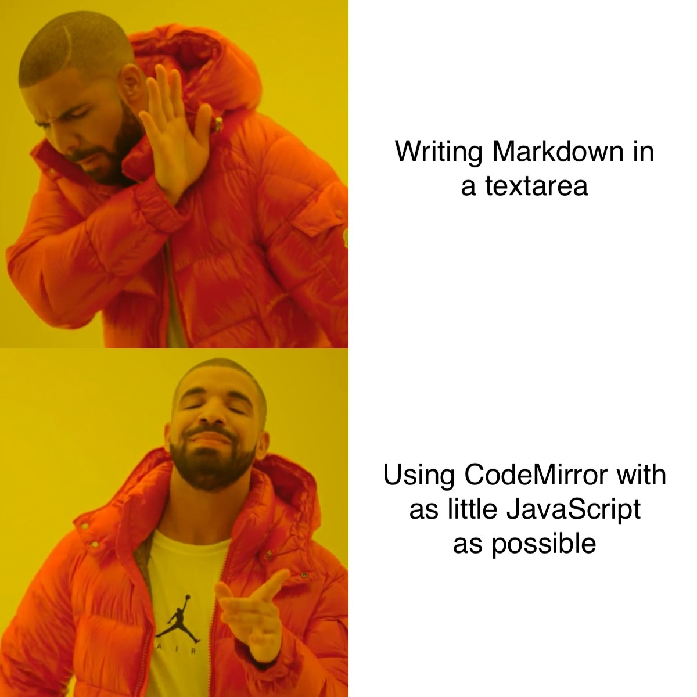

# CodeMirror in 30 minutes and 30 lines of code

This is an example of how top replace a `textarea` field in an HTML form with
[CodeMirror](https://codemirror.net/).

## Setup

To fetch the CodeMirror dependencies, run

    npm install

(`yarn` or `pnpm` should work as well if you prefer).

## Build and Preview

We use [esbuild](https://esbuild.github.io/) to bundle CodeMirror and our
`main.js` script into a single file for easy deployment.

Bundle the code with

    npm run build

Build the code and serve a preview on localhost with

    npm run serve

See the `build` and `serve` scripts in `package.json` for details.

